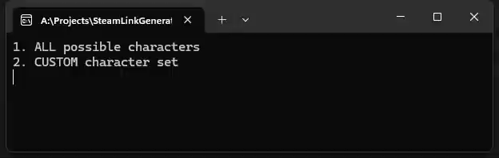
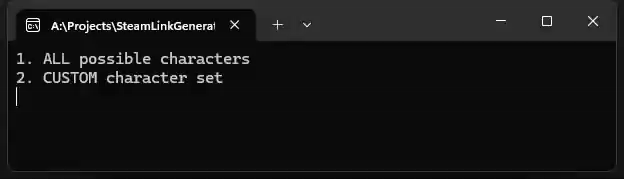

# SteamLinkGenerator
A tool that helps to generate a custom Steam URL

❗**The only limitation is the RAM capacity**❗

## Random Generation
In order to generate the URL from ALL of the available characters:

- Choose the MIN and MAX length of the URL
- Choose the number of threads
- Press ENTER and wait until the process is done

## Custom Generation

- The results will appear in the root folder
  

