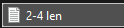

# SteamLinkGenerator
A tool that helps to generate a custom Steam URL

❗**The only limitation is the RAM capacity**❗

## Random Generation
In order to generate the URL from ALL of the available characters:

- Choose the MIN and MAX length of the URL
- Press ENTER and wait until the process is done


- The results will appear in the root folder
  


## Custom Generation
- Go to the source code and change a few lines:


```symbols = "NPC012-_" for exaple```
- Choose the MIN and MAX length of the URL
- Press ENTER and wait until the process is done
